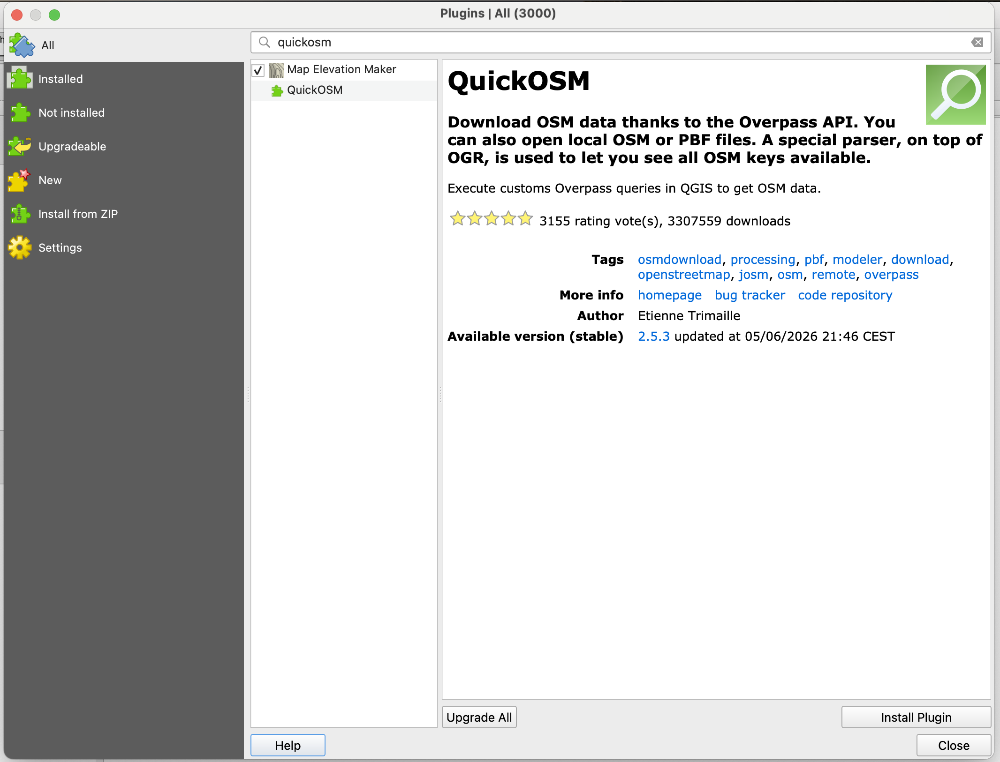

**Installing and setting up QGIS**

This section explains how to install the software and plugins required for creating a historical map, and how to set up a new project. 

1) Install QGIS

Download QGIS Long-Term Release (LTR) from the QGIS website. The LTR version provides a stable environment without requiring regular updates. 

2) Install the QuickOSM plugin 

The QuickOSM plugin allows you to retrieve OpenStreetMap data directly within QGIS, adding geographic information to a project. This includes contemporary geographic and administrative reference data such as roads, settlements, rivers, and borders.

To install the plugin, select Plugins → Manage and Install Plugins. Search for QuickOSM, select the plugin, and click Install Plugin.

Once installed, QuickOSM will be available under the Vector menu. 

3) Create a QGIS project

From the Project menu, create a new QGIS project and save it in a dedicated folder. Setting up the project first gives you a consistent workspace for the map and its supporting data.

Keep the QGIS project file and the data for the map together in the same folder. This makes it easier to move or share the project later.
