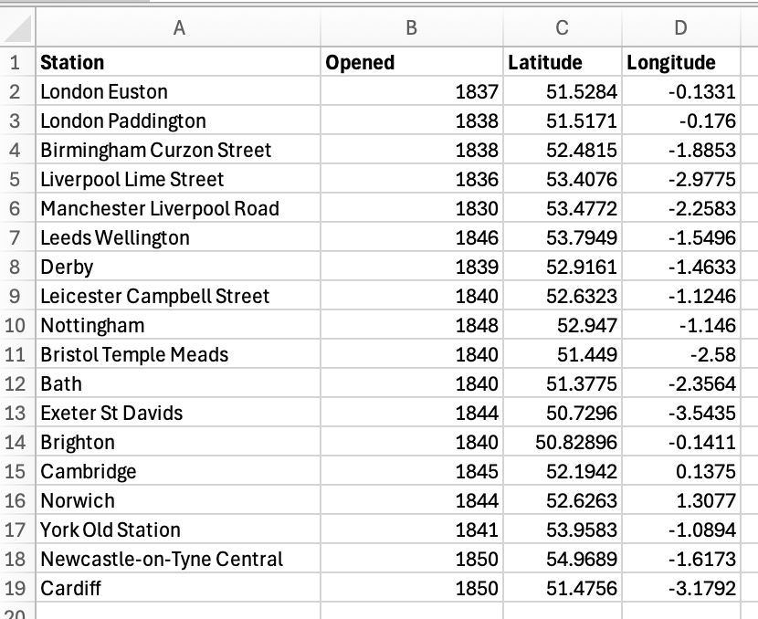

Preparing the data for the map

This section covers the preparation of historical location data before importing it into QGIS.

1) Create a spreadsheet

Create an Excel spreadsheet containing the locations to be mapped, including a unique name for each data point. The text included in the 'Name' column will become the label for the data point on the map. 

2) Add geographic coordinates

Each location requires geographic coordinates which will be the location displayed as a point on the map. Add separate columns for longitude and latitude, using decimal data.

4) Save the spreadsheet

Save the spreadsheet as both a standard Excel file and as a csv file. Keep the Excel file as the master copy of the dataset. 

To add or remove locations in the future, update the Excel master file and then save an updated CSV file, replacing the old version of the existing CSV. Refresh the layer as required by clicking on the refresh symbol of two arrows in the toolbar.

