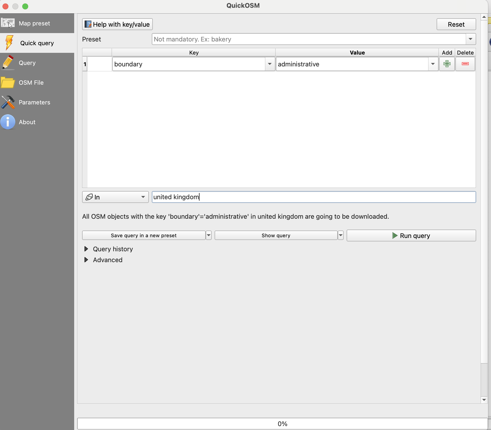
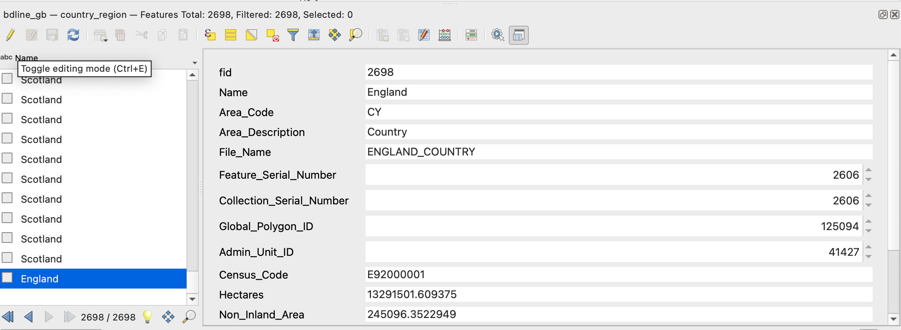
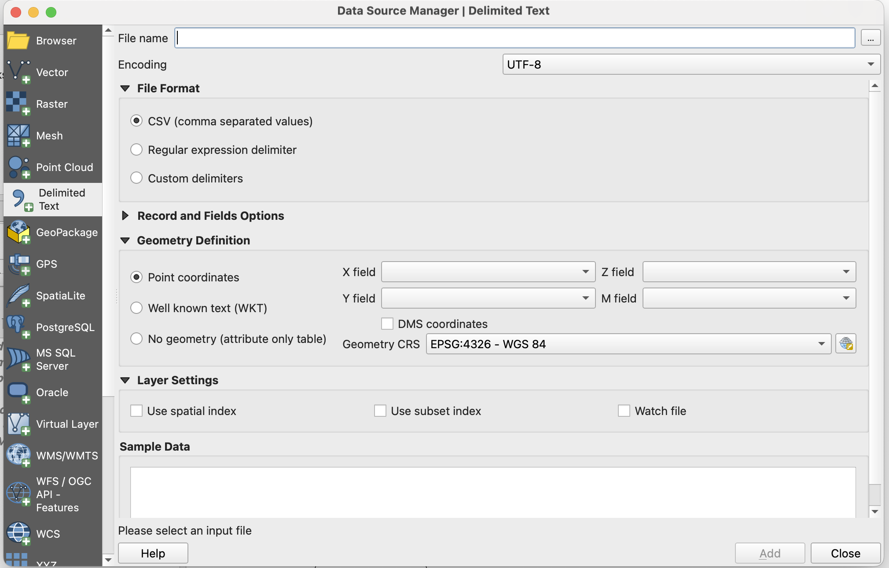

**Creating the historical map**

This section explains how to create base map using data from OpenStreetMap and import the historical data points into the map. OpenStreetMap provides contemporary geographic reference data for the base map, while the historical dataset provides the locations you want to map.

1) Create administrative boundaries

Click on Vector → QuickOSM and then choose Quick Query. 

<ol type="a">
  <li>In the Key field, enter boundary.</li>
  <li>In the Value field, enter administrative.</li>
  <li>In the In field, enter the area covered by the map.</li>
</ol>

QuickOSM will download the available administrative boundary data from OpenStreetMap and add it to the QGIS project.

2) Select the relevant boundaries

Review the administrative boundary layer and identify the boundaries required for the map. Right-click on layer to open the attribute table to check the administrative level and name of each boundary. Use these attributes to identify the appropriate boundaries rather than selecting boundaries based only on their appearance on the map.

If necessary, use the editing mode to remove unwanted boundary features by clicking the yellow pencil icon and selecting the features you want to delete.

3) Save the administrative boundary layer

Save the administrative boundary layer as a local GeoPackage layer so that it can be stored with the project and reused. In the Layers panel, right-click the administrative boundary layer and select Export → Save Features As...

Under Format, select GeoPackage. Choose your project folder as the file location and give the GeoPackage a clear name, such as administrative-boundaries.gpkg. Under Layer name, enter a descriptive name for the layer, such as admin_boundaries. The administrative boundary layer is now saved in the project folder and can be used as your base map.

4) Add the historical data

Add the historical data points to the map by importing the csv data. Go to Layer → Add Layer → Add Delimited Text Layer.

Click on the three dots to the right of the File name line and select the CSV file. Set the X field to Longitude and the Y field to Latitude and the geometry CRS to WGS 84 (EPSG:4326), then click Add. 

The locations should now appear as points on the map.

5) Save the historical data points layer.

Save the historical data points as a GeoPackage layer using the same process as in step 3. Give the layer a descriptive name, such as railway_data.
