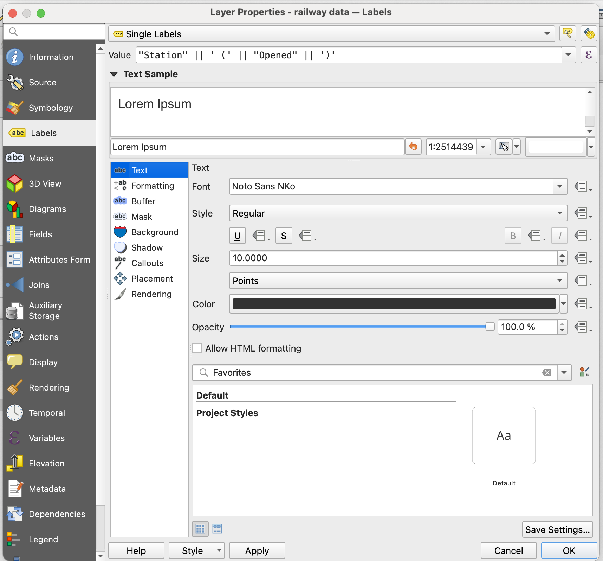

**Annotating the map**

This section explains how to label the historical locations with their name and year, and how to adjust the appearance of the labels and point markers for readability.

1) Open the layer properties

In the Layers panel, right-click the historical location layer and select Properties, then select the Labels tab. Change the label mode from No Labels to Single Labels.

2) Select the label field

Under Value, select the Station field. The location names will now appear as labels on the map.

3) Add additional information to the label

To display the year alongside the location name, in the format Name (Year), use a label expression. Click the expression button (ε) next to the label value and enter:

"Station" || ' (' || "Opened" || ')'

The fields entered in the label expression must exactly match the fields in the csv dataset.

4) Edit the appearance of the labels

Use the Text and Formatting options to adjust the appearance of the labels. The Placement tab allows you to alter the position of the text in relation to the point marker. 

5) Edit the appearance of the data points.

In Layer Properties, select Symbology to change the appearance of the point markers.
