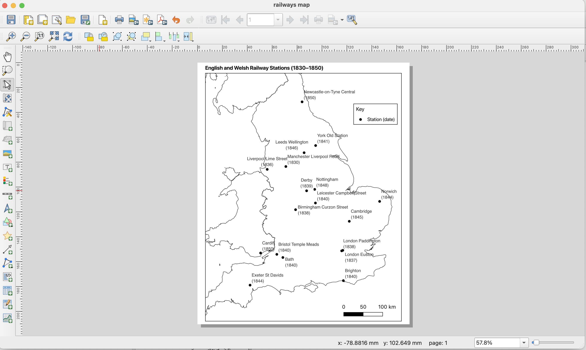

**Exporting the map**

This section covers exporting the completed map from QGIS as a pdf or an image file.

1) Create a print layout

Once the map is complete, go to Project → New Print Layout. Give the layout a descriptive name and click OK. A new print layout will open.

2) Add the map

In the Print Layout window, select Add Item → Add Map and draw a rectangle on the page where the map should appear.

The map will be added to the layout from the current QGIS map view. Adjust the size and position of the map by right-clicking on the map and using Page properties and Item properties.

3) Add map elements

Use Add Item in the Print Layout toolbar to add additional elements required for the final map, including as a title, legend, and scale bar. Check that all labels and map features are clearly visible.

4) Adjustments to the map

Update the map with any adjustments made in the QGIS workspace, including updates from the csv file, by clicking on the symbol of two arrows to refresh the map.

5) Export the map

Once you have finished, export the map from the Layout menu, selecting Export as pdf or export as image. 

